# Tugas 1 IF3110 Pengembangan Aplikasi Berbasis Web

## Anggota Kelompok

* 13518079 Fadhil Muhammad Rafi'
* 13518087 Radhinansyah Hemsa Ghaida
* 13518091 Fakhrurrida Clarendia Widodo

## Deskripsi Aplikasi Web

Secara ringkas, aplikasi yang dibuat adalah aplikasi web yang digunakan untuk menjual coklat-coklat terbaik di dunia. Aplikasi web diharapkan dapat melakukan pendaftaran akun, login, logout, pencarian produk, mendapatkan penjelasan produk secara detail, pembelian produk dan dapat melihat riwayat pembelian produk, dan pekerjanya dapat dengan mudah menambahkan jenis coklat baru yang ingin dijual serta menambah ketersediaan coklat. Adapun tools yang digunakan dalam pembangunan aplikasi web ini adalah Javascript, HTML dan CSS untuk frontend, PHP untuk backend, dan MySQL untuk database.

## Spesifikasi

### Login Page

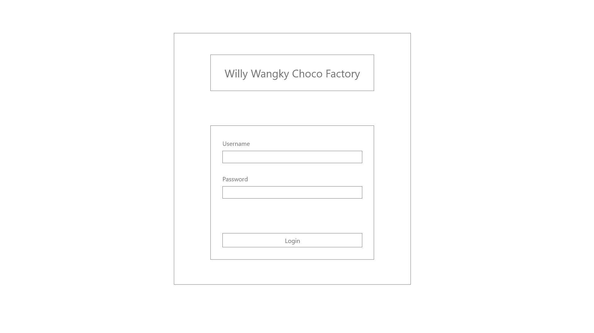

Halaman pertama yang ditampilkan jika pengguna belum login atau sudah logout adalah halaman Login.
Pengguna dapat melakukan login sebagai user atau superuser. Login hanya membandingkan email dan password saja. 
Tidak perlu tambahan proteksi apapun.

Identitas pengguna yang sudah login akan disimpan sebagai cookie dalam browser. Cookie menyimpan data pengguna dalam bentuk string dengan panjang tertentu. Untuk mengetahui pengguna mana yang sedang login, string tersebut dapat dilihat di basis data. Identitas tersebut tidak boleh disimpan sebagai parameter HTTP GET. Jika cookie ini tidak ada, maka pengguna dianggap belum login dan aplikasi akan selalu mengarahkan (redirect) pengguna ke halaman ini, meskipun pengguna membuka halaman yang lain. Masa berlaku cookie dibebaskan.

### Register Page

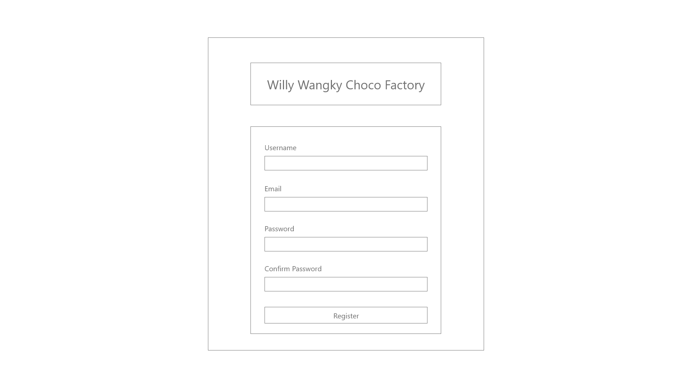

Pengguna dapat mendaftarkan akun baru jika belum login atau sudah logout.
Pada halaman ini, pengguna mendaftarkan diri dengan email dan username yang unik.
Pengguna tidak dapat mendaftar sebagai superuser, karena superuser ditambahkan secara manual pada basis data.
Pengecekan keunikan nilai field dilakukan menggunakan AJAX. Jika unik, border field akan berwarna hijau.
Jika tidak unik, akan muncul pesan error pada form.

Validasi lain yang dilakukan pada sisi klien pada halaman ini adalah:
* Email memiliki format email standar seperti “example@example.com”.
* Username hanya menerima kombinasi alphabet, angka, dan underscore.

Setelah semua nilai field sudah diisi dan valid, pengguna dapat mendaftarkan akun barunya.
Jika akun berhasil didaftarkan, pengguna langsung diarahkan ke halaman Dashboard.
Mekanisme cookie sama dengan halaman Login.

### Dashboard page

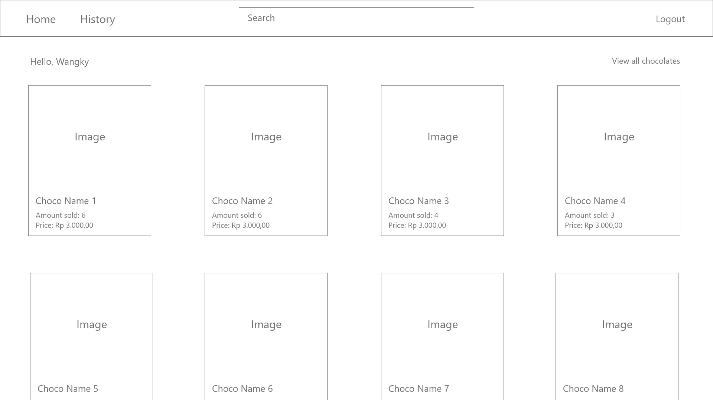

Pada halaman Dashboard, pengguna disambut dengan username pengguna dan daftar coklat yang tersedia.
Coklat ditampilkan secara terurut sesuai dengan banyak coklat yang terjual, mulai dari yang paling banyak sampai yang paling sedikit.
Banyak coklat yang ditampilkan dibatasi hanya sampai 10 coklat dengan penjualan terbanyak.
Pengguna dapat melihat detail coklat dengan mengklik gambar atau nama coklat.
Header aplikasi web untuk user terdiri dari search bar, pilihan untuk melihat daftar transaksi, dan pilihan untuk logout, sedangkan untuk superuser terdiri dari search bar, pilihan untuk menambah jenis coklat, dan pilihan untuk logout. Search bar digunakan untuk mencari coklat berdasarkan nama. Hasil pencarian ditampilkan pada halaman Search Result. Jika pengguna memilih untuk logout, pengguna akan diarahkan ke halaman Login.

### Search Result page

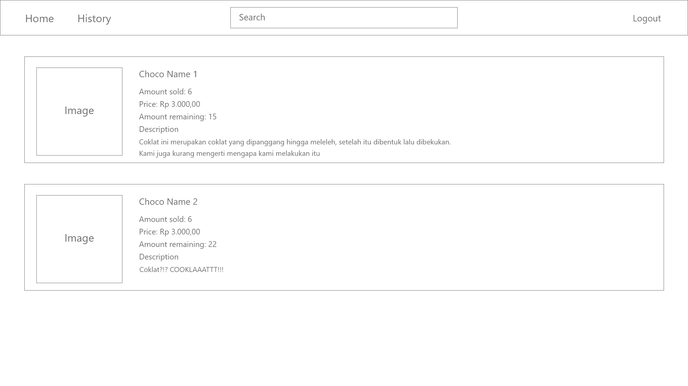

Hasil pencarian dari search bar di halaman Dashboard akan ditampilkan pada halaman ini. Untuk setiap coklat, ditampilkan informasi nama, deskripsi, banyak coklat terjual, dan gambar coklat. Pengguna dapat melihat detail coklat dengan menekan bagian manapun pada section coklat tersebut.

Jika daftar coklat melebihi jumlah tertentu (jumlah didefinisikan sendiri), maka akan muncul pagination untuk melihat daftar coklat selebihnya. Ketika memilih page, pengguna tidak diarahkan ke halaman baru namun daftar coklat langsung berubah di halaman ini.

### Chocolate Detail page

Pada halaman Chocolate Detail, terdapat beberapa informasi mengenai coklat yang dipilih,
yaitu nama, gambar, banyak coklat terjual, deskripsi, harga, dan ketersediaan dari coklat tersebut.
Jika coklat dengan jenis tersebut masih tersedia, pengguna dapat memilih tombol “Buy Now” yang kemudian akan menampilkan banyak coklat yang dibeli,
alamat pengiriman, total harga, tombol “Cancel” dan tombol “Buy” sebagai berikut:

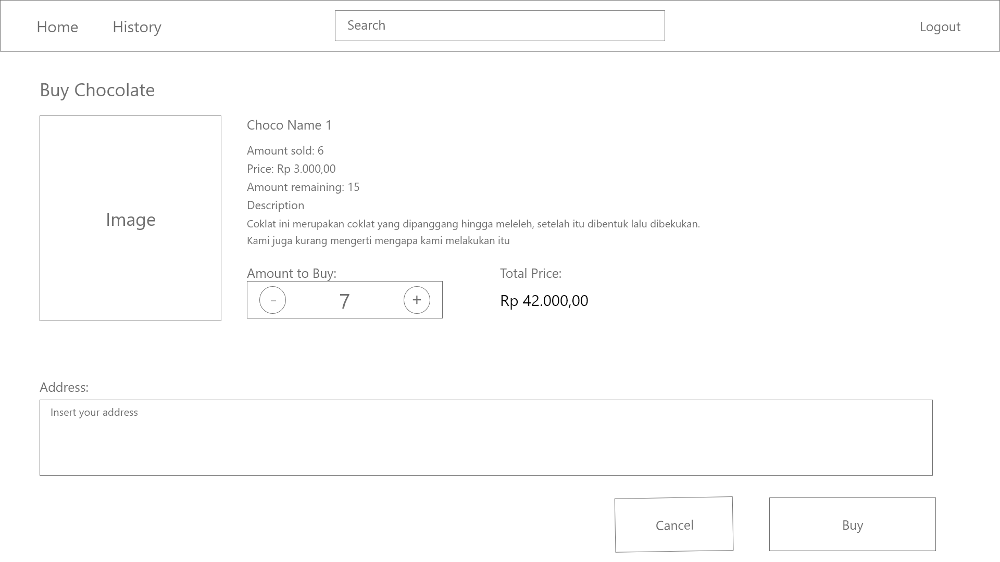

Pengguna memilih jumlah pembelian coklat dan alamat pengiriman.
Perubahan total harga ditampilkan secara real-time sesuai dengan perubahan jumlah pembelian coklat.
Pengguna tidak dapat melakukan pembelian coklat melebihi banyak coklat yang tersedia.
(Asumsi saat proses pembelian coklat, ketersediaan coklat tidak berubah).
Pastikan setelah proses pembelian, ketersediaan coklat berubah sebanyak jumlah yang dibeli.
Jika pengguna login sebagai superuser, tombol “Buy Now” digantikan oleh tombol “Add Stock” yang jika ditekan akan menampilkan banyak coklat yang ingin ditambah, tombol “Cancel” dan tombol “Add” sebagai berikut :

### Transaction History Page

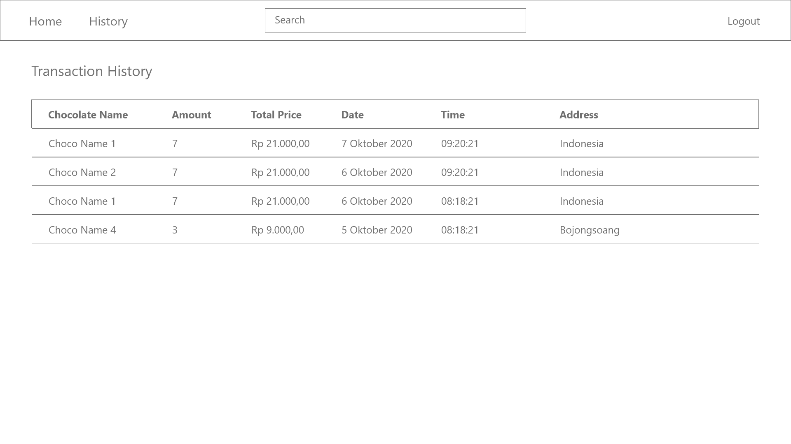

Pada halaman ini, ditampilkan daftar coklat yang telah dibeli.
Daftar diurutkan berdasarkan tanggal pembelian coklat. 
Untuk setiap transaksi, ditampilkan informasi nama, jumlah pembelian, total harga, waktu pembelian dan alamat pengiriman.
Pengguna dapat mengetahui detail coklat yang telah dibeli dengan menekan nama coklat yang akan mengarahkan pengguna ke halaman Chocolate Detail.

### Add New Chocolate Page

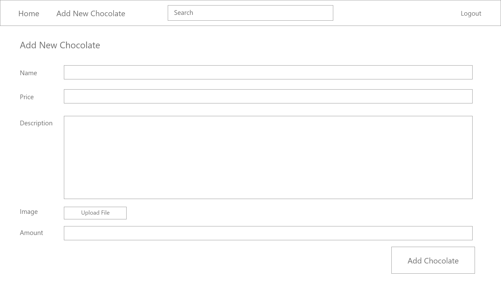

Halaman ini hanya bisa diakses oleh superuser melalui pilihan untuk menambah jenis coklat pada header web.
Pada halaman ini, superuser dapat menambah jenis coklat yang ada beserta detail dari coklat tersebut.
Detail dari coklat meliputi nama, gambar, deskripsi, harga, dan ketersediaan dari coklat tersebut.
Seluruh detail pada coklat harus diisi sebagai persyaratan coklat dapat ditambahkan.

## Cara Instalasi dan Menjalankan Server

1. Secara simpel, untuk menjalankan aplikasi web, disarankan untuk terlebih dahulu melakukan instalasi server XAMPP dengan mengikuti video ini `https://youtu.be/-f8N4FEQWyY`
2. Setelah itu, pengguna clone terlebih dahulu repo ini ke dalam folder `../xampp/htdocs` (xampp adalah direktori instalasi XAMPP).
3. Lalu, pengguna harus membuka XAMPP control panel untuk kemudian melakukan start Apache & MySQL.
4. Setelah itu, tekan `admin` pada MySQL dan kemudian setelah phpMyAdmin terbuka, buat database baru bernama willywangky dan lakukan import file `willywangky.sql` yang ada pada repo ini.
5. Setelah itu, buka `localhost/tugas-besar-1-2020/html/login.html` pada web browser untuk mulai menjalankan aplikasi web Willy Wangky.

## Tangkapan Layar Aplikasi
### Login Page

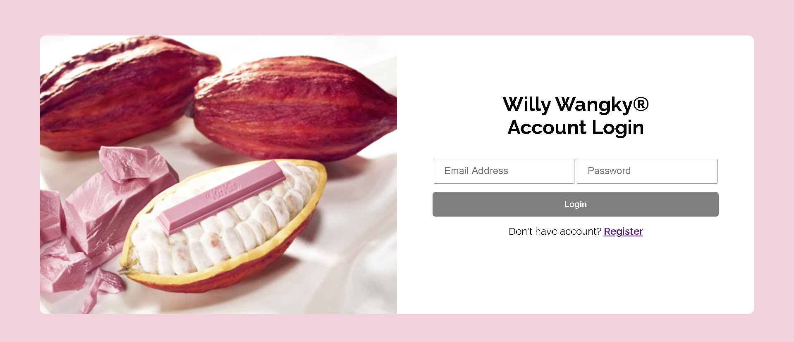

### Register Page

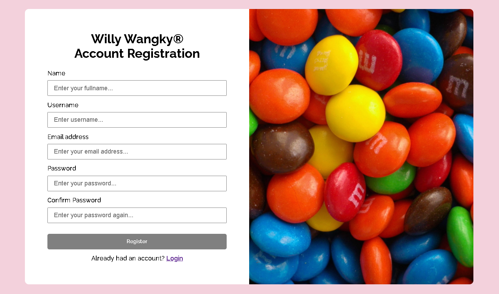

### Dashboard page

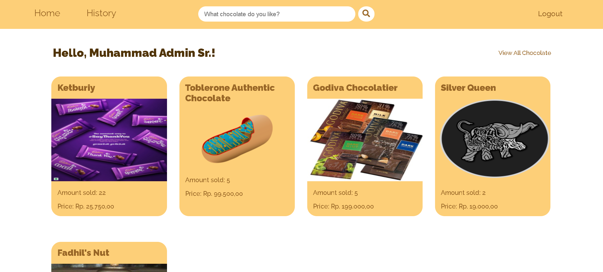

### Search Result page

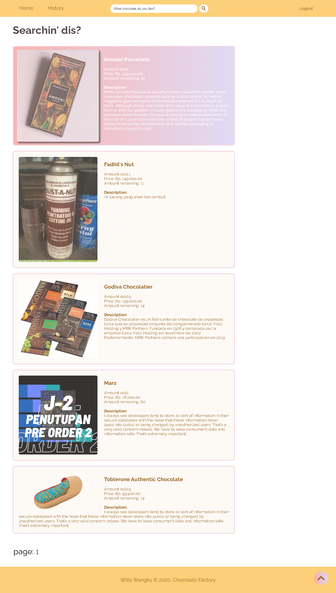

### Chocolate Detail page
#### Untuk User

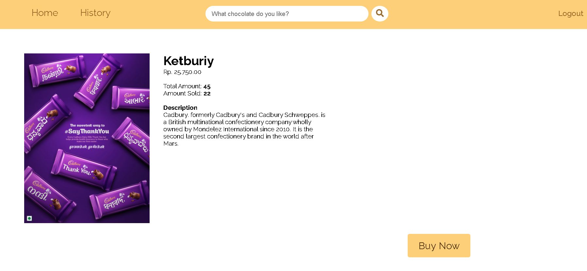

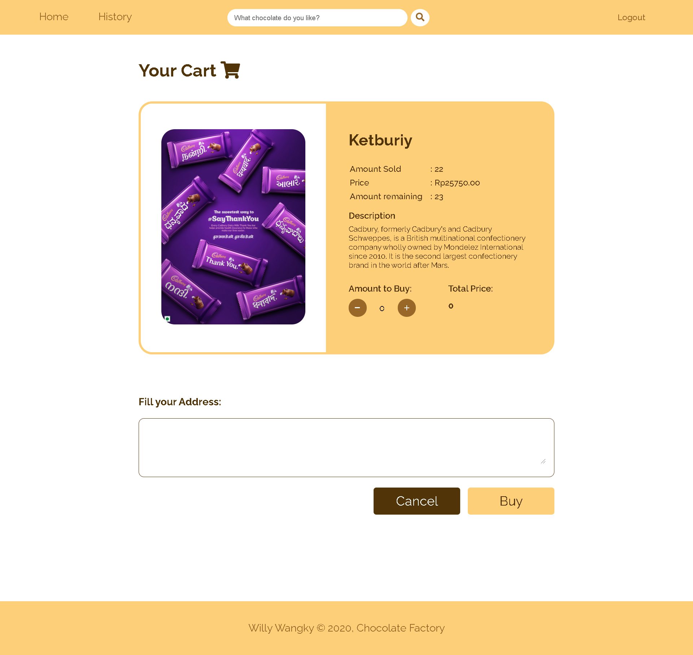

#### Untuk Admin
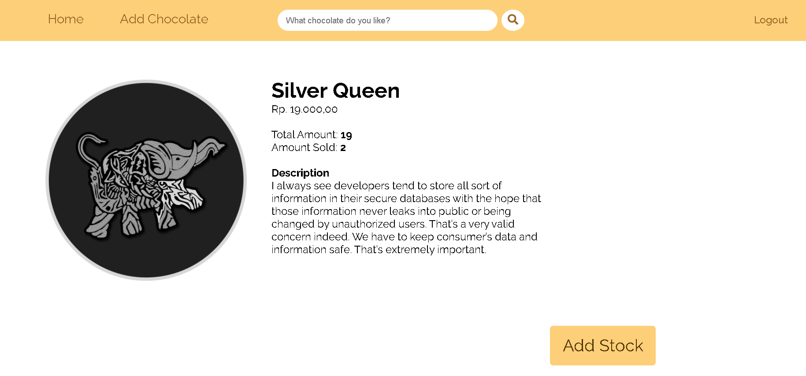

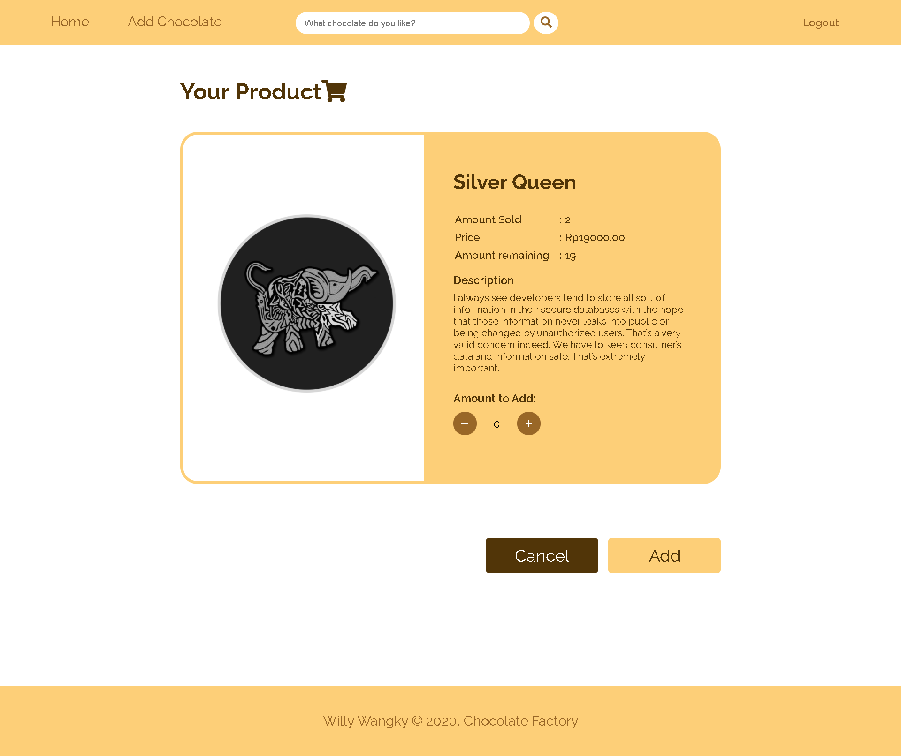

### Transaction History Page

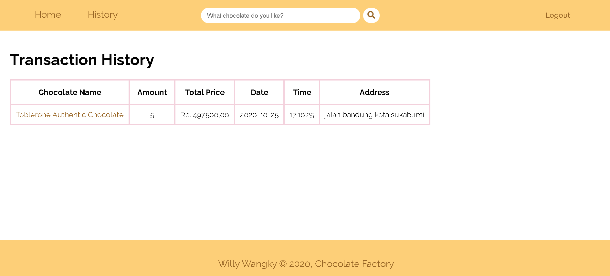

### Add New Chocolate Page

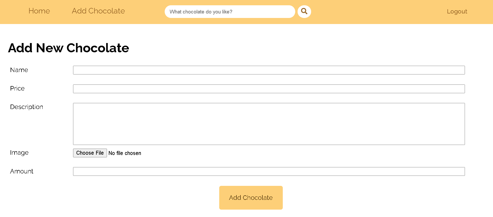

## Screenshot Perubahan tampilan

## Pembagian Tugas

### REST
1. Supplier fungsi tampil bahan: 13518087
2. Supplier fungsi transaksi bahan: 13518087

### SOAP
1. GET: 13518079
2. POST: 13518079

### ReactJS
1. Login: 13518091
2. SupplierScreen: 13518091, 13518087
3. Dashboard: 13518091
4. KeuanganScreen: 13518079

## About

Kelompok Gillian's Friend IF3110 - 2020

Padil | Radhin | Edo